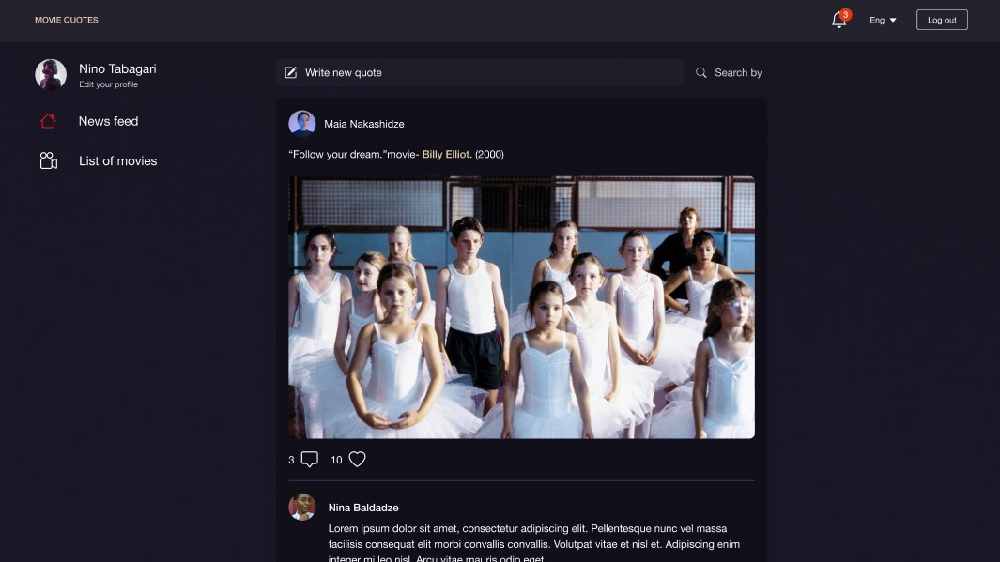

  <h1 style="position:relative; top: -6px" >Epic movie quotes</h1>

---

### Screenshot

Epic movie quotes - is a platform where users can first register, then log in and view quotes from movies. Also add quotes, movies. update data, change their user data, etc. NOT FINISHED, STILL IN PROGRESS!!!

#

### Table of Contents

- [Prerequisites](#prerequisites)
- [Tech Stack](#tech-stack)

### Prerequisites

-  _Node JS @12.X and up_
-  _Yarn @1.X and up_
-  _npm @6 and up_

#

### Tech Stack

-  [Next js](https://nextjs.org) - front-end framework
-  [Tailwind CSS @3.2.4](https://tailwindcss.com/) - CSS framework
-  [React Hook Form @7.41.3](https://react-hook-form.com/) - library for form validation

#

